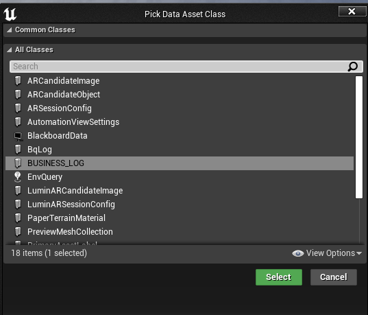

# Game Engine Integration Guide

[← Back to Home](../README.md) | [简体中文](./ENGINE_INTEGRATION_CHS.md)

---

## Unity / Tuanjie Engine

### Integration

- **Unity**
  - Download `unity_package_{version}` from the [Releases page](https://github.com/Tencent/BqLog/releases);
  - Unzip and in Unity Package Manager select "Install from tarball", pointing to the `.tar` file inside to import;
  - Official Unity does not support HarmonyOS yet; if you need HarmonyOS support, you can integrate it yourself as needed.

- **Tuanjie Engine**
  - Download `tuanjie_package_{version}` from the [Releases page](https://github.com/Tencent/BqLog/releases);
  - Unzip and import via Unity Package Manager as tarball similarly;
  - The main difference from Unity is that HarmonyOS related support is already integrated.

### Usage

After importing, use the `bq.log` C# API:

```csharp
string config = @"
    appenders_config.console.type=console
    appenders_config.console.levels=[all]
";
var log = bq.log.create_log("cs_log", config);
log.info("Hello from Unity! value:{}", 42);
```

For more examples, refer to `/demo/csharp` directory in the repository.

---

## Unreal Engine

Pick any one of the following ways to integrate.

### Supported engine versions

| Install method | Supported Unreal Engine versions |
|---|---|
| **Fab** | UE 4.22 – 4.27 and UE 5.0 – 5.8 (one dedicated zip per officially available engine minor) |
| **Prebuilt (GitHub Release)** | UE 4.25 – 4.27 (`ue4` zip), UE 5.0 – 5.8 (`ue5` zip), and current UE6 development builds (`ue6` zip) |
| **Source (GitHub Release)** | UE 4.25 – 4.27 (`ue4` zip), UE 5.0 – 5.8 (`ue5` zip), and current UE6 development builds (`ue6` zip) |

> **On UE 4.22 / 4.23 / 4.24?** Install through [Fab](https://www.fab.com/listings/386d1c78-e164-4e97-8b3e-e88cbf9b6acf) — the per-engine-version Fab zips account for `.uplugin` token differences in those older UE4 minors (older UBT revisions don't recognize `UncookedOnly` or `LinuxAArch64`). The single GitHub `ue4` zip targets UE 4.25+.
>
> **Mac / iOS on UE 4.22 and 4.23:** Due to Fab build-machine limitations, the Fab zips for UE 4.22 and 4.23 do **not** include Mac or iOS binaries. If you need Mac or iOS support on these two engine versions, please download the **Source** or **Prebuilt** package from the [GitHub Releases page](https://github.com/Tencent/BqLog/releases) and integrate it manually.
>
> **Using UE6?** Download the `ue6` Source or Prebuilt plugin manually from the [GitHub Releases page](https://github.com/Tencent/BqLog/releases). These packages currently use the same plugin implementation as UE5 and have been verified with current UE6 development builds. UE6 is still under development, so compatibility may be adjusted as the engine changes. Fab cannot distribute the UE6 package yet because Epic's official Fab engine support currently ends at UE 5.8.

### Integration

- **Fab (recommended)**
  - Install from the Epic Fab listing: [BqLog on Fab](https://www.fab.com/listings/386d1c78-e164-4e97-8b3e-e88cbf9b6acf);
  - Use the Epic Games Launcher / Fab client to add the plugin to your engine, then enable it in your project — no manual download or unzip required;
  - Recommended when you want the easiest installation and automatic updates through Fab.

- **Prebuilt**
  - Download `unreal_plugin_prebuilt_ue4_{version}` (UE 4.25 – 4.27), `unreal_plugin_prebuilt_ue5_{version}` (UE 5.0 – 5.8), or `unreal_plugin_prebuilt_ue6_{version}` (current UE6 development builds) from the [Releases page](https://github.com/Tencent/BqLog/releases);
  - Unzip to the `Plugins` directory of your game project.

- **Source**
  - Download `unreal_plugin_sources_ue4_{version}` (UE 4.25 – 4.27), `unreal_plugin_sources_ue5_{version}` (UE 5.0 – 5.8), or `unreal_plugin_sources_ue6_{version}` (current UE6 development builds) from the [Releases page](https://github.com/Tencent/BqLog/releases);
  - Unzip to the `Plugins` directory of your game project, to be recompiled by the engine.

After extraction, verify that the plugin descriptor is at the following path. An extra nested `BqLog` directory will prevent Unreal from discovering the plugin correctly.

```text
<YourProject>/Plugins/BqLog/BqLog.uplugin
```

### Enabling the Plugin

Add the BqLog plugin to your `.uproject` file's `Plugins` section:

```json
"Plugins": [
    {
        "Name": "BqLog",
        "Enabled": true
    }
]
```

> Merge this entry into an existing `Plugins` array rather than adding a second `Plugins` key. Plugins placed in the project `Plugins` directory are usually discovered automatically, but explicitly declaring BqLog is recommended for clarity and version control. No `.uproject` `AdditionalDependencies` entry is required.

### Adding BqLog Module Dependency

In every game module that includes BqLog headers, add `"BqLog"` to that module's `.Build.cs`. If BqLog is used only by `.cpp` files, a private dependency is preferred:

```csharp
PrivateDependencyModuleNames.AddRange(new string[] {
    "BqLog"
});
```

Use `PublicDependencyModuleNames` instead if one of your module's public headers exposes BqLog types or includes a BqLog header:

```csharp
PublicDependencyModuleNames.Add("BqLog");
```

You can then include the Unreal adapter from C++:

```cpp
#include "BqLog.h"
```

> Do **not** add include directories manually. The `BqLog` module exports the required paths. The Blueprint node module `BqLogBPNodes` is editor-only and does **not** need to be added to your dependencies. After changing `.uproject` or `.Build.cs`, regenerate project files if your IDE does not refresh automatically, then rebuild the Editor target.

### 1) Support for `FName` / `FString` / `FText`

In Unreal environment, BqLog has built-in adapters:

- Automatically support `FString`, `FName`, `FText` as format string and parameters;
- Compatible with UE4, UE5, and current UE6 development builds.

Example:

```cpp
bq::log log_my = bq::log::create_log("AAA", config);   // config omitted

FString fstring_1 = TEXT("This is a test FString{}");
FString fstring_2 = TEXT("This is also a test FString");
log_my.error(fstring_1, fstring_2);

FText text1 = FText::FromString(TEXT("This is a FText!"));
FName name1 = FName(TEXT("This is a FName"));
log_my.error(fstring_1, text1);
log_my.error(fstring_1, name1);
```

If you wish to customize adaptation behavior, you can also use "Method 2 (Global Function)" to define `bq_log_format_str_size` and `bq_log_format_str_chars` yourself (see [Advanced Usage](./ADVANCED_USAGE.md)).

### 2) Redirect BqLog output to Unreal Log Window

The Unreal plugin automatically redirects all BqLog output to Unreal's Output Log — no extra setup is required.

> **Note:** If you are integrating BqLog at the C++ level without the plugin, you can use `bq::log::register_console_callback` to forward logs to `UE_LOG` manually. See [Advanced Usage](./ADVANCED_USAGE.md) for details.

### 3) Using BqLog in Blueprint

After importing the Unreal plugin, BqLog can be called directly in Blueprint:

1. **Create Log Data Asset**

   - Create Data Asset in Unreal project, type select BqLog:
     - Default Log Type (without Category):
       
     - If Log Class with Category is generated (see [Advanced Usage — Category](./ADVANCED_USAGE.md)), and `{category}.h` and `{category}_for_UE.h` are added to project:
       

2. **Configure Log Parameters**

   - Double click to open Data Asset, configure log object name and creation method:
     - `Create New Log`: Create a new Log object at runtime:
       
     - `Get Log By Name`: Only get Log with same name created elsewhere:
       

3. **Call Log Node in Blueprint**

   

   - Area 1: Add log parameters;
   - Area 2: Added log parameter nodes, can be deleted via right click menu (Remove ArgX);
   - Area 3: Select log object (i.e. Data Asset just created);
   - Area 4: Displayed only when log object has Category, can select log Category.

4. **Test**

   - Run Blueprint, if configured correctly and there is ConsoleAppender output, similar output can be seen in Log window:

     ```text
     LogBqLog: Display: [Bussiness_Log_Obj] UTC+7 2025-11-27 14:49:19.381[tid-27732 ] [I] [Factory.People.Manager] Test Log Arg0:String Arg, Arg1:TRUE, Arg2:1.000000,0.000000,0.000000|2.999996,0.00[...]
     ```

---

## Next Steps

- [Integration Guide](./INTEGRATION_GUIDE.md) — Integration for all platforms and languages
- [API Reference](./API_REFERENCE.md) — Core APIs for creating logs, writing logs, and more
- [Advanced Usage](./ADVANCED_USAGE.md) — Category, custom types, encryption, and more
